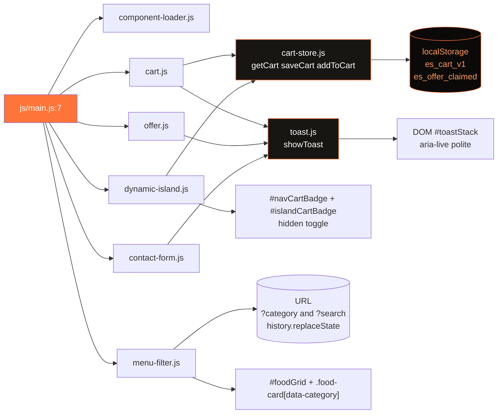
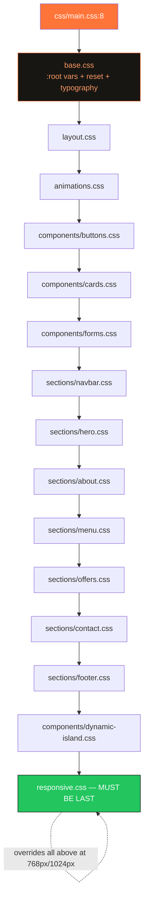
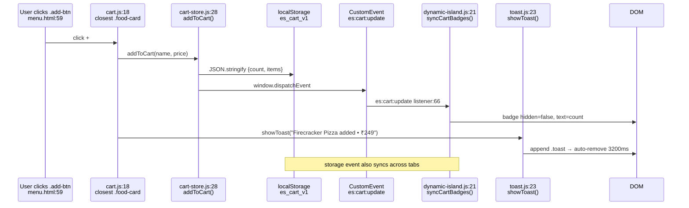
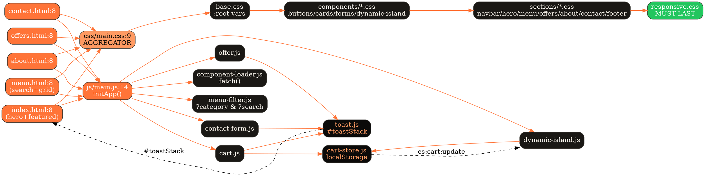

# Ember & Spice — Team Competition Handbook

> Read this `README.md` end-to-end before coding. 6-person modular split — works for **this site** and **any similar site** (Hospital / School / E-commerce / Travel / Portfolio) you get in competition.

## Quick Start

```bash
# run locally (from project root)
python3 run_site.py
# or
npx serve .
```

*   Entry CSS: `css/main.css:9` (imports `base.css` > `components/*` > `sections/*` > `responsive.css:31` — keep order)
*   Entry JS: `js/main.js:14` `initApp()` → `js/utils/component-loader.js:1` → `js/features/*.js` (each file checks DOM, safe on any page)
*   Components: `components/*.html` (navbar, footer, dynamic-island, hero, menu, offers, about, contact)

---

## Architecture Overview

```
5 Pages:
  index.html:30   → Hero + Quick Categories + Featured (3 cards) + About Teaser + Offer Teaser
  menu.html:33    → Search + Category Tabs + 8 food-cards (pizza/burger/biryani/dessert)
  offers.html:30  → Main 20% OFF block + 3 promo cards
  about.html:30   → Story + Why Us (3 cards) + Visit Us
  contact.html:30 → 3 info cards + Form (#contactForm) + Map placeholder

Shared Chrome (every page):
  components/navbar.html + components/footer.html + components/dynamic-island.html
  → rendered as top <nav class="navbar"> + bottom pill <nav id="dynamicIsland"> (index.html:172)
  → cart badges: #navCartBadge + #islandCartBadge (hidden toggle)

CSS: css/main.css → base.css, layout.css, animations.css, components/buttons.css,cards.css,forms.css,dynamic-island.css, sections/navbar.css,hero.css,about.css,menu.css,offers.css,contact.css,footer.css, responsive.css
JS:  js/main.js → features/menu-filter.js, cart.js, offer.js, contact-form.js, dynamic-island.js + utils/cart-store.js, toast.js, component-loader.js
```

**Golden Rule:** `css/responsive.css` must be imported last. Never rename IDs/classes in the contract below.

**Contract — Do NOT Rename:**
`#foodGrid`, `#searchBox`, `.category`, `.add-btn`, `#toastStack`, `#dynamicIsland`, `#navCartBadge`, `#islandCartBadge`, `data-category`, `.is-active`, `#contactForm`

---

## 6-Person Module Split (Parallel — Zero File Overlap)

### P1 — Shell & Layout System [LEAD / INTEGRATION]

| Item | Detail |
|---|---|
| **Generic Role** | Header + Navigation + Footer + Layout + Routing — Works for any project |
| **In This Project** | Top Navbar + Bottom Dynamic Island Pill + Footer + Global Layout |
| **Owns These Files ONLY** | `components/navbar.html`, `components/footer.html`, `components/dynamic-island.html`, `css/sections/navbar.css`, `css/sections/footer.css`, `css/components/dynamic-island.css`, `css/base.css`, `css/layout.css`, `css/responsive.css`, `js/features/dynamic-island.js`, `js/utils/component-loader.js` |
| **Builds** | Sticky top `navbar` (logo + cart + Order Now), bottom pill nav (`index.html:172` `island-track` with 5 links, `is-active` state, keyboard `1-5` shortcuts), footer, `skip-link` a11y, cart badge sync contract, responsive breakpoints. **Merges everyone at end.** |
| **Don't Touch** | Food cards, forms, cart logic |
| **Deliverable** | All pages share identical navbar/footer/island, active page highlighted, responsive mobile→desktop, `1-5` keys switch pages |

**Topics & Keywords to Learn:**
*   **Core Topics:** CSS Variables (`--primary`, `--bg-secondary` in `css/base.css:1`), Flexbox vs Grid, `position: sticky` vs `fixed`, Z-index stacking, `skip-link` accessibility, `fetch()` component loader pattern
*   **Keywords to Search:** `CSS custom properties`, `flexbox navbar responsive`, `dynamic island CSS pill navigation`, `responsive breakpoints 768px 1024px`, `aria-label menubar role`, `keyboard shortcuts JS keydown 1-5`, `component loader fetch HTML MDN`, `z-index stacking context`, `skip to content accessibility`
*   **MDN/YouTube:** MDN `CSS variables`, `position: fixed`, `aria-current="page"` — YouTube: "responsive navbar flexbox 2024"
*   **1hr Practice:** Build a navbar + bottom pill nav that highlights active page via `.is-active` + `aria-current`. Test `css/responsive.css:1` mobile.

### P2 — Landing / Hero Specialist

| Item | Detail |
|---|---|
| **Generic Role** | Hero / Landing Section + CTA + Stats — Any project needs this |
| **In This Project** | Hero + Quick Categories + Featured Preview + Stats |
| **Owns These Files ONLY** | `components/hero.html`, `css/sections/hero.css`, `css/animations.css`, Sections in `index.html:30` (Hero `31-60`, Quick Nav `63-75`, Featured `78-129`, About Teaser `132-140`) |
| **Builds** | `WELCOME TO` eyebrow + `Taste the Extraordinary.` heading with `span` color, `hero-text`, two CTAs (`main-btn`/`second-btn` in `css/components/buttons.css:1`), `mini-stat` (500+/20%/4.8★), `food-circle` `🍕`, quick category links (`menu.html?category=pizza` → `menu-filter.js` reads URL) |
| **Don't Touch** | Menu filter JS, cart |
| **Deliverable** | Pixel-perfect hero, quick nav 5 pills, 3-card featured teaser with `+` buttons |

**Topics & Keywords to Learn:**
*   **Core Topics:** Hero layout (`css/sections/hero.css:1`), `clamp()` fluid typography, `linear-gradient`, `@keyframes` (`css/animations.css:1`), `food-circle` decoration
*   **Keywords to Search:** `hero section HTML CSS 2024`, `clamp font-size responsive fluid`, `CSS gradient background`, `CSS keyframes fadeInUp`, `mini stats grid flex`, `call to action CTA button design`, `background circle decoration CSS`, `viewport units clamp vw`
*   **MDN/YouTube:** MDN `clamp()`, `linear-gradient()`, `@keyframes` — YouTube: "hero section design html css"
*   **1hr Practice:** Clone any landing hero with `h1 span {color: var(--primary)}` + 2 buttons + 3 stats boxes. Use `clamp(32px, 5vw, 56px)` for heading.

### P3 — Listing / Catalog / Search Specialist

| Item | Detail |
|---|---|
| **Generic Role** | Grid Listing + Search + Filter — Most reusable (Products/Doctors/Courses/Destinations) |
| **In This Project** | Full Menu Catalog: Search + Category Filter + 8 Cards |
| **Owns These Files ONLY** | `components/menu.html`, `css/sections/menu.css`, `css/components/cards.css`, `js/features/menu-filter.js` |
| **Builds** | `menu.html:35` search `#searchBox` (`placeholder` + live filter), category tabs `role="tablist"` (`All/Pizza/Burger/Biryani/Desserts` with `.active` + `aria-selected`), 8 `food-card` (`data-category`, `.food-image`, `.food-info`, `.food-bottom` with `₹` + `+`), URL sync `?category=` & `?search=` via `URLSearchParams`, shareable filtered views, empty state |
| **Don't Touch** | `cart-store.js`, toast |
| **Deliverable** | Typing filters cards, clicking category filters + updates URL, direct link `menu.html?category=biryani` pre-filters |

**Topics & Keywords to Learn:**
*   **Core Topics:** `food-grid` Grid (`css/sections/menu.css:1` / `css/components/cards.css:1`), `data-*` attributes, `input` `input` event + `String.includes()` + `toLowerCase()`, `URLSearchParams`, `role="tablist"` a11y
*   **Keywords to Search:** `CSS grid auto-fit minmax 280px`, `filter JavaScript data attributes`, `search debounce JavaScript 300ms`, `URLSearchParams get set pushState`, `tablist aria-selected tabs`, `card hover transform translateY`, `empty state no results design`, `case insensitive search JS`
*   **MDN/YouTube:** MDN `URLSearchParams`, `dataset`, `Array.filter()` — YouTube: "javascript filter search grid"
*   **1hr Practice:** 8-card grid + 4 filter buttons + search box that filters by `h3` text + syncs to URL. Use `new URLSearchParams(location.search)`.

### P4 — State & Interaction Specialist [HARDEST JS — Assign Best Dev]

| Item | Detail |
|---|---|
| **Generic Role** | State Management + Notifications — Cart/Wishlist/Booking/Any persisted state |
| **In This Project** | Cart + Toast + Badge Sync |
| **Owns These Files ONLY** | `js/features/cart.js`, `js/utils/cart-store.js`, `js/utils/toast.js`, `css/components/buttons.css` (`.add-btn`) |
| **Builds** | `localStorage` cart (`cart-store.js:1` `JSON.stringify/parse`), event delegation for all `.add-btn` (`cart.js:1`), badge update `#navCartBadge` + `#islandCartBadge` (`hidden` toggle + count), toast stack `#toastStack` (`toast.js:1` `aria-live="polite"`), `Added to cart` feedback, persists on refresh, syncs across pages |
| **Don't Touch** | Contact validation, menu-filter internals |
| **Deliverable** | Click `+` → badge increments in top nav + bottom island + toast appears → refresh keeps count |

**Topics & Keywords to Learn:**
*   **Core Topics:** `localStorage` persistence, Event Delegation (`document.addEventListener('click')`), Badge sync (`hidden` attribute), Toast stack with `setTimeout` auto-dismiss, `aria-live`
*   **Keywords to Search:** `localStorage JSON stringify parse persist`, `event delegation JavaScript bubbling`, `cart badge update hidden attribute`, `toast notification stack vanilla JS`, `aria-live polite assertive`, `add to cart animation pulse`, `state management vanilla JS no framework`, `localStorage cart tutorial`
*   **MDN/YouTube:** MDN `localStorage`, `Event.target.closest()`, `aria-live` — YouTube: "javascript cart localStorage"
*   **1hr Practice:** Click `+` → increment badge in header + pill + show toast `Added to cart` (3s auto-hide) → persists on refresh via `localStorage`.

### P5 — Promo / Highlight Specialist

| Item | Detail |
|---|---|
| **Generic Role** | Offers / Pricing / Featured / Testimonials — Marketing block |
| **In This Project** | Offers Page: Main 20% OFF + 3 Promo Cards |
| **Owns These Files ONLY** | `components/offers.html`, `css/sections/offers.css`, `js/features/offer.js` |
| **Builds** | `offers.html:30` two-column `.offers` (`.offer-content` + `.offer-number` `20% OFF` big text), `CLAIM OFFER` button (`offer.js:1` → toast + `localStorage` flag + disables after claim), 3 promo cards (`offers.html:57` Free dessert/Student/First order) with `linear-gradient` bg, `How discount works` FAQ |
| **Don't Touch** | Forms, cart store |
| **Deliverable** | Click CLAIM → `Offer claimed!` toast + button becomes `Claimed ✓` + flag saved, 3 promo cards link to `menu.html?category=` |

**Topics & Keywords to Learn:**
*   **Core Topics:** `sections/offers.css:1` two-column flex/grid, `offer-btn` claim logic, promo card `linear-gradient` backgrounds, `localStorage` claimed flag, `offer.js` idempotency
*   **Keywords to Search:** `offer section two column CSS`, `claim offer button JavaScript localStorage`, `promo cards gradient background`, `countdown timer JavaScript` (common variant), `discount badge CSS big text`, `CSS offer-number huge typography`, `limited time offer design`, `promo grid responsive`
*   **MDN/YouTube:** MDN `localStorage`, `button disabled` — YouTube: "offer section html css"
*   **1hr Practice:** Offer block with `20% OFF` + `CLAIM` that disables after click, saves to `localStorage`, shows toast. Add 3 gradient promo cards.

### P6 — Info & Forms Specialist

| Item | Detail |
|---|---|
| **Generic Role** | About / Contact / Team + Form Validation + Map — Trust + Lead capture |
| **In This Project** | About Page + Contact Page + Form |
| **Owns These Files ONLY** | `components/about.html`, `components/contact.html`, `css/sections/about.css`, `css/sections/contact.css`, `css/components/forms.css`, `js/features/contact-form.js` |
| **Builds** | `about.html:30` story (`01/02/03` points) + `Why Us` 3-card `featured-grid` (`🌿`/`👨‍🍳`/`⚡`) + Visit Us CTA, `contact.html:30` 3 info cards (`📍`/`📞`/`✉️` with `tel:`/`mailto:`), `#contactForm` (`contact.html:55` `novalidate` → custom JS: name/email/subject/message required, email regex, `preventDefault()` → toast success), map placeholder (replace with `iframe` Google Maps) |
| **Don't Touch** | Dynamic island, cart |
| **Deliverable** | About story + contact form validates (empty + email) + `Message sent!` toast + map placeholder |

**Topics & Keywords to Learn:**
*   **Core Topics:** `novalidate` + Constraint Validation API (`contact-form.js:1`), `input-row` grid (`css/components/forms.css:1` / `css/sections/contact.css:1`), `textarea`, `tel:`/`mailto:` links, `iframe` embed
*   **Keywords to Search:** `HTML form validation JavaScript preventDefault`, `constraint validation API MDN`, `CSS grid form layout input-row`, `input required pattern email regex`, `form submit toast success error`, `Google Maps embed iframe responsive`, `contact info cards design`, `textarea placeholder styling`
*   **MDN/YouTube:** MDN `Constraint validation`, `RegExp` email, `HTMLFormElement` — YouTube: "javascript form validation"
*   **1hr Practice:** Name/Email/Subject/Message form with `novalidate`, validate empty + `^[^\s@]+@[^\s@]+\.[^\s@]+$`, show `Message sent!` toast on success, error inline.

---

## If You Get a Different Project — Quick Map

Same 6 blocks, just rename content:

| Competition Theme | P3 (Catalog) Becomes | P4 (State) Becomes | P5 (Promo) Becomes |
|---|---|---|---|
| **E-commerce** | Product Grid + Search | Shopping Cart + Wishlist | Deals / Featured Products |
| **Hospital** | Doctors / Services Filter | Appointment Booking | Health Packages |
| **College / School** | Courses Filter | Application / Enroll Cart | Scholarships / Events |
| **Travel** | Destinations Grid + Search | Trip Booking / Itinerary | Packages / Testimonials |
| **Real Estate** | Property Listings Filter | Shortlist / Compare | Featured Properties |
| **Portfolio** | Projects Grid Filter | Like / Save State | Featured Work / Pricing |

**P1, P2, P6 stay same in every theme:** P1=Shell, P2=Landing, P6=About+Contact.

---

## Common for Everyone (30 mins tonight)

*   **Git:** `clone`, `add`, `commit -m`, `push`, `pull --rebase`, `status`, `diff` — P1 creates repo, all clone, never push to `main` simultaneously
*   **Tools:** VS Code Live Server, `python3 run_site.py`, `npx serve .`
*   **CSS Core:** Variables (`var(--primary)`), `flex`, `grid`, `clamp()`, `media queries` (`responsive.css:1`), `hover`/`transition`
*   **A11y:** `alt`, `aria-label`, `aria-current`, `skip-link` (`<a class="skip-link" href="#main">`), `aria-live="polite"` for toasts
*   **Mobile-First:** Design at 360px first, then 768px, then 1024px+

---

## Competition Timeline (2–3 Hour Hack)

| Time | Action |
|---|---|
| **0–15m** | P1 scaffolds repo + `css/main.css:9` import order + `js/main.js:14` `initApp()` + deploys `run_site.py`. All clone. Agree on Contract (IDs above). |
| **15–90m** | Each builds owned module **in isolation** with dummy text. P3+P4 sync 5 mins on `cart-store.js` API (`addItem(name, price)`). |
| **90–105m** | Integration: P1 merges `components/*.html` → CSS imports → JS initializers. Test all 5 pages. |
| **105–120m** | QA: Search, cart badge, island `is-active`, form validation, responsive (Chrome DevTools 375px/768px), keyboard `1-5`, toast. Fix. |

**Merge Order:** `components/` → `css/sections/` → `js/features/` → `js/utils/`. Never edit `main.css`/`main.js` simultaneously — only P1.

---

## File Ownership Cheat Sheet (Stick on Wall)

```
P1: components/navbar.html, footer.html, dynamic-island.html | css/base.css, layout.css, responsive.css, sections/navbar.css, footer.css, components/dynamic-island.css | js/dynamic-island.js, utils/component-loader.js
P2: components/hero.html | css/sections/hero.css, animations.css | index.html:31-157
P3: components/menu.html | css/sections/menu.css, components/cards.css | js/features/menu-filter.js | menu.html:33-163
P4: js/features/cart.js, utils/cart-store.js, utils/toast.js | css/components/buttons.css
P5: components/offers.html | css/sections/offers.css | js/features/offer.js | offers.html:30-84
P6: components/about.html, contact.html | css/sections/about.css, contact.css, components/forms.css | js/features/contact-form.js | about.html, contact.html
```

---

## How to Verify Your Block Works

*   **P1:** Open any page → navbar + pill visible, active link orange, `1`→Home `2`→Menu `3`→Offers `4`→About `5`→Contact works, mobile pill doesn't overlap footer.
*   **P2:** `index.html` → hero centered, stats 3-col, quick nav pills link to `menu.html?category=...` and pre-filter works.
*   **P3:** `menu.html` → type `cheese` → only Cheese Burst shows, click `Biryani` tab → 2 biryanis, URL becomes `?category=biryani`, refresh keeps filter.
*   **P4:** Click any `+` → top badge + pill badge increment, toast `Added to cart` appears, refresh keeps count, `localStorage.getItem('cart')` has data.
*   **P5:** `offers.html` → click `CLAIM OFFER` → toast `Offer claimed! 20% OFF` → button disabled/`Claimed ✓` → refresh stays claimed.
*   **P6:** `contact.html` → submit empty → error toast, invalid email → error, valid → `Message sent!` toast, form clears. `about.html` 3 cards visible.

---

## Keywords to Search (Copy-Paste into YouTube/MDN)

```
P1: CSS custom properties flexbox navbar dynamic island pill navigation responsive breakpoints 768px 1024px aria-label menubar
P2: hero section clamp fluid typography CSS gradient keyframes fadeInUp CTA button
P3: CSS grid auto-fit minmax filter data attributes search debounce URLSearchParams tablist
P4: localStorage JSON event delegation cart badge toast aria-live state management
P5: offer two column claim button localStorage promo cards gradient countdown
P6: form validation novalidate constraint validation email regex Google Maps iframe
```

**Tonight's Homework (1hr each):** Each person builds *one* CodePen with their block using any theme (e.g., P3 builds a movie filter grid, P4 a cart) and pushes screenshot to group. Tomorrow you just replace text/images with competition theme.

---

© 2026 Ember & Spice • Built modular for competitions • Press `1-5` for shortcuts • `python3 run_site.py` to run

---

## File Connection Maps (Mermaid + Graphviz)

> All diagrams are additive — no existing contents were modified. View on GitHub (Mermaid renders automatically) or copy DOT to https://dreampuf.github.io/GraphvizOnline/

### 1) High-Level: HTML ↔ CSS ↔ JS (Mermaid)

```mermaid
flowchart TD
    subgraph HTML["HTML Entry Points (5 Pages)"]
        A[index.html:8<br/>links css/main.css<br/>loads js/main.js:200]
        B[menu.html:8]
        C[offers.html:8]
        D[about.html:8]
        E[contact.html:8]
    end

    subgraph CSS["CSS — css/main.css:9 Aggregator"]
        M[css/main.css]
        M --> BA[base.css:6<br/>:root vars --primary]
        M --> L[layout.css]
        M --> AN[animations.css]
        M --> CB[components/buttons.css]
        M --> CC[components/cards.css]
        M --> CF[components/forms.css]
        M --> SN[sections/navbar.css]
        M --> SH[sections/hero.css]
        M --> SM[sections/menu.css]
        M --> SO[sections/offers.css]
        M --> SA[sections/about.css]
        M --> SC[sections/contact.css]
        M --> SF[sections/footer.css]
        M --> DI[components/dynamic-island.css]
        M --> R[responsive.css LAST]
        BA -.-> CB
        BA -.-> CC
        BA -.-> SN
    end

    subgraph JS["JS — js/main.js:14 initApp()"]
        JM[js/main.js<br/>DOMContentLoaded]
        JM --> CL[utils/component-loader.js:15<br/>fetch components/*.html]
        JM --> MF[features/menu-filter.js:7]
        JM --> CA[features/cart.js:7]
        JM --> OF[features/offer.js:7]
        JM --> CF2[features/contact-form.js:8]
        JM --> DIJ[features/dynamic-island.js:8]
        CA --> CS[utils/cart-store.js:7<br/>localStorage es_cart_v1]
        CA --> TO[utils/toast.js:23<br/>#toastStack]
        OF --> TO
        CF2 --> TO
        DIJ --> CS
        CS -.-> DIJ
    end

    subgraph COMP["components/*.html (Injected)"]
        CN[navbar.html]
        CF0[footer.html]
        CD[dynamic-island.html]
        CH[hero.html]
        CM[menu.html]
        CO[offers.html]
        CA2[about.html]
        CC2[contact.html]
        CL -.-> CN
        CL -.-> CF0
        CL -.-> CD
    end

    A --> M
    A --> JM
    B --> M
    B --> JM
    C --> M
    C --> JM
    D --> M
    D --> JM
    E --> M
    E --> JM

    style M fill:#ff7438,stroke:#fff,color:#fff
    style JM fill:#ff7438,stroke:#fff,color:#fff
    style CS fill:#1a1815,stroke:#ff7438,color:#fff
    style TO fill:#1a1815,stroke:#ff7438,color:#fff
```



### 2) JS Dependency Graph — Who Imports Whom (Mermaid)



### 3) CSS Import Order (Mermaid) — `css/main.css:9`



### 4) Data Flow — Add to Cart → Badge Sync (Mermaid Sequence)



### 5) Graphviz DOT — Full File Map (copy to GraphvizOnline)



### 6) Quick Legend — Which Person Owns Which Arrow

| Arrow | Owner | Files |
|---|---|---|
| `HTML → css/main.css` | P1 | `css/base.css`, `layout.css`, `responsive.css`, `sections/navbar.css` |
| `HTML → js/main.js` | P1 | `js/utils/component-loader.js` |
| `js/main.js → menu-filter.js → #foodGrid` | P3 | `sections/menu.css`, `components/cards.css` |
| `js/main.js → cart.js → cart-store.js → island` | P4 | `components/buttons.css`, `utils/*` |
| `js/main.js → offer.js → toast.js` | P5 | `sections/offers.css` |
| `js/main.js → contact-form.js → toast.js` | P6 | `sections/about.css`, `contact.css`, `components/forms.css` |
  | `loader → components/*.html` | P1 | All `components/*.html` templates |

> Tip: Open this file on GitHub to see Mermaid rendered. For DOT, paste into https://dreampuf.github.io/GraphvizOnline/ → Export SVG for your PPT.

